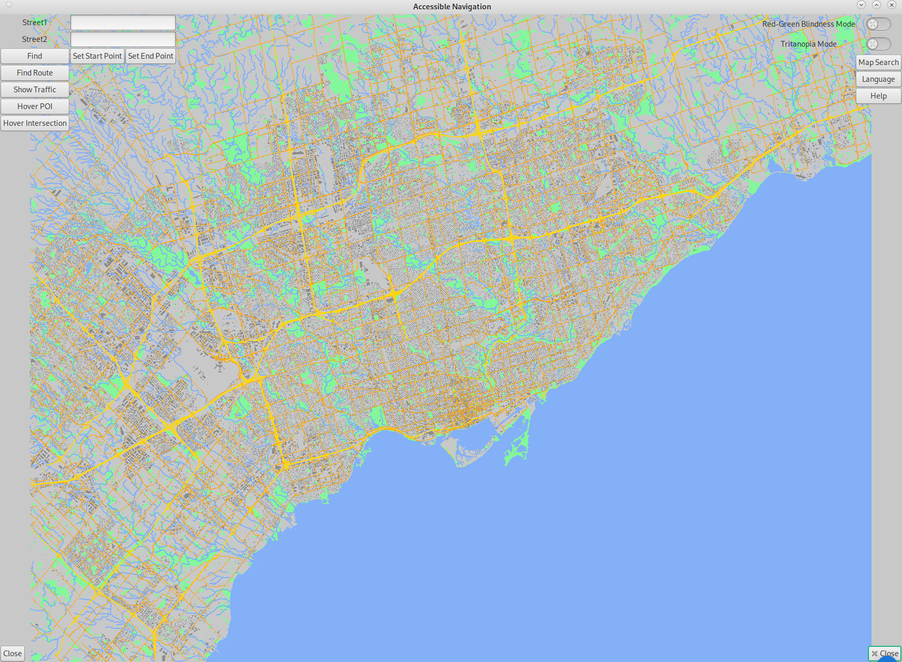
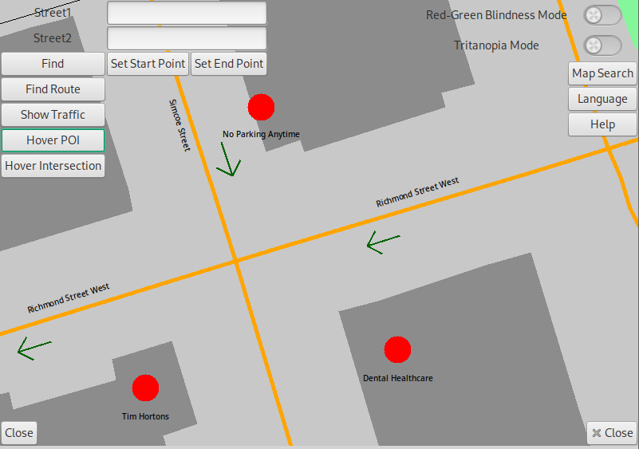
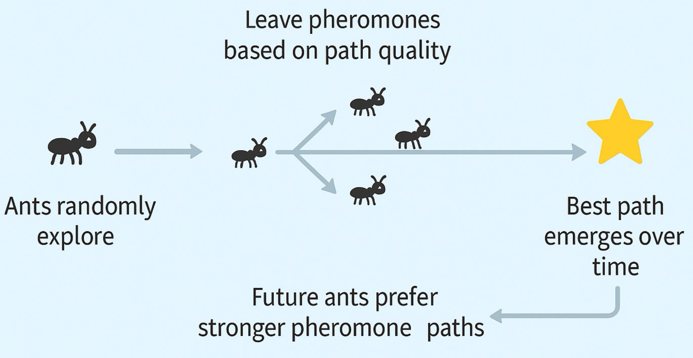
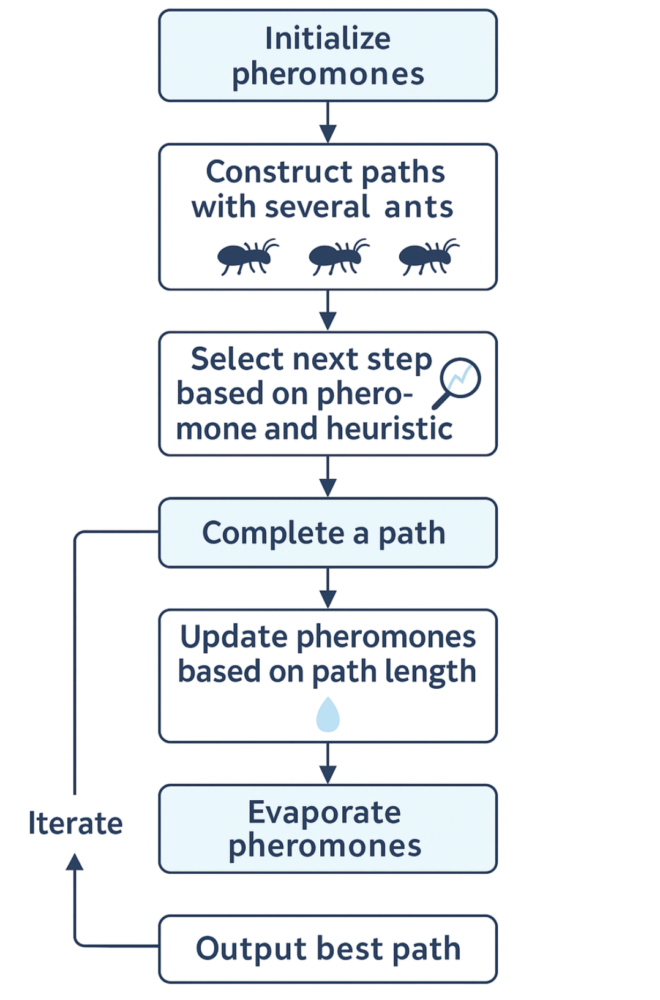
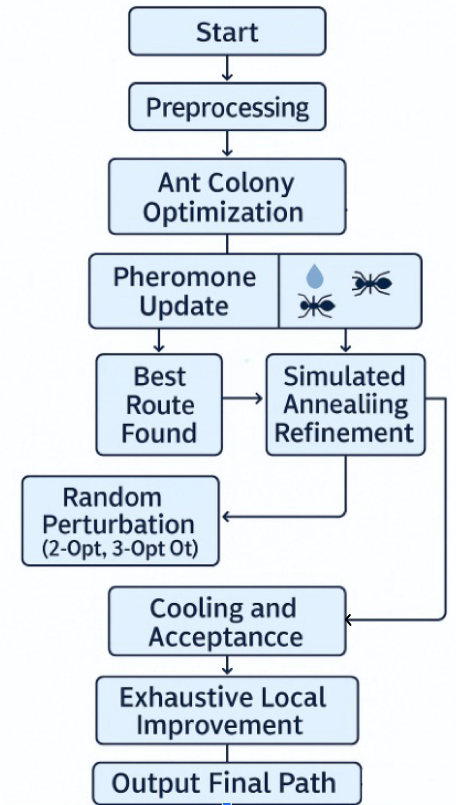
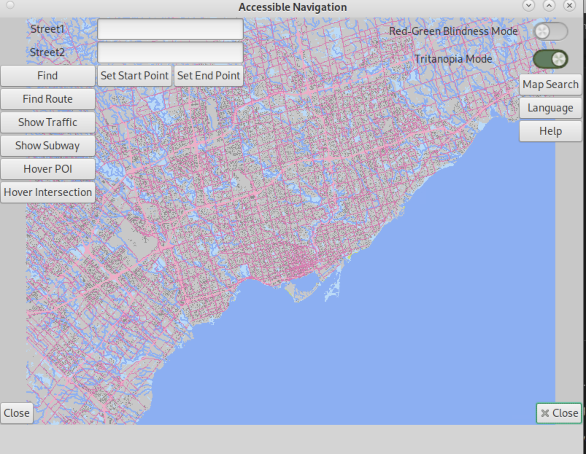
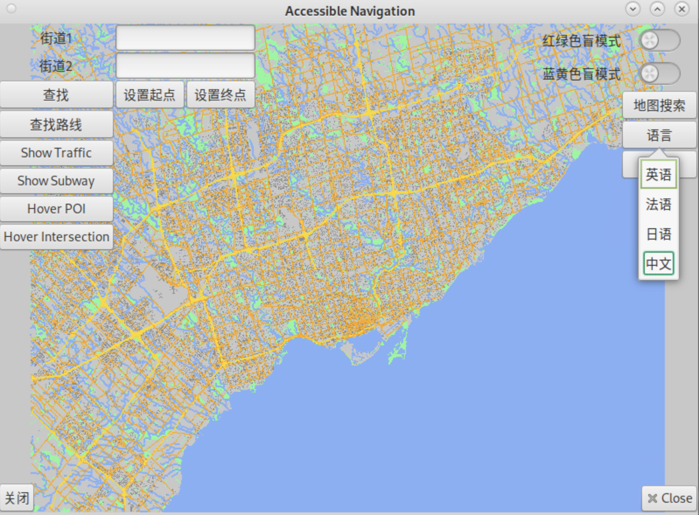

# 🗺️ Accessible Navigation: Smart, Inclusive, Efficient Map Routing System

---

## ✨ Project Overview
➡️ View our full presentation [here](https://docs.google.com/presentation/...)  

This project implements an interactive, accessible, and high-performance geographic map system. The system provides:
- ✅ **Accessible navigation** for users with color-blindness or language barriers
- ✅ **Intuitive user interface** with fast feedback and visual clarity
- ✅ **Efficient routing** for couriers and delivery agents across city maps

---

## 📅 Timeline & Milestones

| Milestone | Highlights |
|----------|-----------|
| **M1** | Built back-end APIs and fast data structures |
| **M2** | Developed interactive map visualization & partial rendering |
| **M3** | Integrated routing algorithms with UI logic |
| **M4** | Implemented simulated annealing + ACO courier routing engine |

---
## 🛠️ Tech Stack

- **Language**: C++17  
- **Graphics Library**: [EZGL](https://ug251.eecg.utoronto.ca/ece297s/ezgl_doc/index.html) – simple abstraction over GTK for GUI drawing  
- **GUI Framework**: GTK+3  
- **Development Environment**: Ubuntu with X11 forwarding / local GTK setup  
- **Editor**: Visual Studio Code / CLion with remote debugging
---

## 🔍 Features

### 🗺️ Interactive Map Interface
- Panning and zooming with visual overlays
- Partial rendering: updates only what is needed
- Preloaded map data for speed

 

---

### ⚙️ API and Functionality
- Locate intersections from partial names
- Find closest intersections
- Highlight and label results
- Built with performance constraints: <0.1s interactions

---

### 🔄 Routing Algorithms
- **Dijkstra-based Greedy**: fast, but not always optimal
- **Simulated Annealing**: explores alternate paths
- **ACO (Ant Colony Optimization)**: pheromone-inspired global search
- **2-Opt / 3-Opt**: fine-tune route paths for travel-time reduction

---

### 🧑‍🦯 Accessibility First
- **Color Blind Mode**: simulate Protanopia, Tritanopia with friendly palettes
- **Language Switch**: auto-detect spoken language and switch UI
- **Instructional Aids**: route arrows, hover info, helper videos

---

## ✅ Usability & Performance

| Metric | Description |
|--------|-------------|
| ⏱️ **Responsiveness** | Feedback within 100ms–1s |
| 🔢 **Search Speed** | Constant or log-time lookup |
| 🌐 **Inclusivity** | Designed for color-blind, low-literacy, multilingual users |

---

## 🌐 Future Extensions

- Integrate real-time traffic for adaptive routing
- Personalize paths for wheelchair users, elderly, etc.
- Fully voice-driven UI interaction

---

## 📚 References

[🔗 View Our Final Presentation (Google Slides)](https://docs.google.com/presentation/d/15y97ETW6AfkCTlMkzRorLlXkuzb7-MtjOM6yxGsZD6o/edit?usp=sharing)

⚠️ Note: Due to University of Toronto academic policies, we are not permitted to publicly release the source code of this project.

---

## 👨‍💻 Team Members

- **Ryan (Shidu) Ren** 
- **Cathy Zhang**
- **Paul Yang**